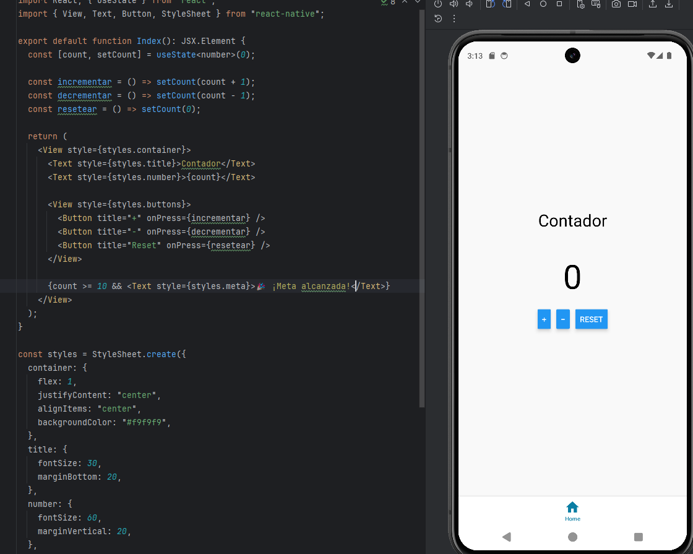

# AppContador_UT1

**Autor:** Diego Arbelo Gonzalez
**Fecha:** 17/10/2025  
**Versión Expo SDK:** 52 (React Native 0.76)  
**Target Android:** API 34  
**Repositorio:** [https://github.com/tuusuario/AppContador_UT1](https://github.com/tuusuario/AppContador_UT1)

---

## 🧩 Tecnología elegida

**Expo (React Native con TypeScript)**

He elegido Expo porque permite crear y probar aplicaciones móviles de manera rápida y multiplataforma (Android e iOS) sin necesidad de configurar manualmente herramientas nativas complejas.  
Expo ofrece compatibilidad inmediata con **React Native**, soporte en **emuladores** y ejecución directa en dispositivos físicos mediante la app **Expo Go**, lo que facilita el desarrollo y las pruebas.

---

## ⚙️ Configuración del entorno y ejecución

### 1️⃣ Requisitos previos
- Node.js (versión LTS) instalado.
- npm o yarn.
- Expo CLI(se instala automáticamente con `npx`).
- Android Studio (para emulador) o Expo Go (para dispositivo físico).

### 2️⃣ Creación del proyecto
```bash
npx create-expo-app AppContador_UT1
cd AppContador_UT1
npm start

| Carpeta / Archivo | Descripción                                                             |
| ----------------- | ----------------------------------------------------------------------- |
| `app/index.tsx`   | Archivo principal con el componente del contador.                       |
| `package.json`    | Define dependencias y scripts de ejecución.                             |
| `app.json`        | Configuración de la aplicación Expo (nombre, versión, permisos, icono). |
| `node_modules/`   | Dependencias instaladas automáticamente.                                |
| `assets/`         | Carpeta para imágenes, íconos o fuentes personalizadas.                 |
| `babel.config.js` | Configuración del compilador de React Native.                           |

Perfil de despliegue

Expo SDK: 52

React Native: 0.76

Dispositivo de prueba: Emulador Pixel 8 (Android 14, API 34)

Resolución: 1080 × 2400 px

Modo de ejecución: Expo Go (QR y emulador Android Studio)


Funcionamiento de la app

La app muestra un contador interactivo con las siguientes funciones:

+ → Incrementa el número.

− → Decrementa el número.

Reset → Reinicia el contador a cero.

Cuando el valor llega a 10, aparece el mensaje “Meta alcanzada”.

Estado inicial: 0
Actualización: instantánea gracias al hook useState.




Conclusión y limitaciones

Durante esta práctica aprendí a:

Configurar un entorno móvil con Expo y React Native.
Crear componentes funcionales con el hook useState para gestionar estados dinámicos.
Ejecutar y depurar la app tanto en un emulador Android como en un dispositivo físico.

Limitaciones y retos:

El emulador Android puede ser lento sin aceleración por hardware.
Expo Go requiere estar en la misma red Wi-Fi o usar modo Tunnel.
La app no guarda el valor del contador tras cerrarse (sin backend o almacenamiento local).